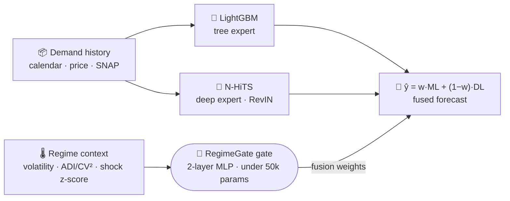

<div align="center">

# 🧭 RegimeGate

### An Adaptive Fusion Controller for Non‑Stationary Demand

**AI for Public Good — Sustainable & Resilient Supply Chains**
<br/>
<sub>Problem Statement 3 · Round 2 · Team <b>Absolute</b> — Ayan Ahmed Khan</sub>

<br/>


<br/>

[](https://ai-for-public-good-sustainable-resi-sable.vercel.app/)
[](https://colab.research.google.com/github/AyanAhmedKhan/AI-for-Public-Good-Sustainable-Resilient-Supply-Chains/blob/main/RegimeGate_M5.ipynb)
[](https://vercel.com/new/clone?repository-url=https%3A%2F%2Fgithub.com%2FAyanAhmedKhan%2FAI-for-Public-Good-Sustainable-Resilient-Supply-Chains&root-directory=web)

[**📄 Solution Document**](docs/RegimeGate_Solution_Document.pdf) · [**🖥️ Slide Deck**](docs/RegimeGate_Presentation.pptx)

<br/>

<a href="https://ai-for-public-good-sustainable-resi-sable.vercel.app/" target="_blank">

</a>

<sub><i>▶ The <a href="https://ai-for-public-good-sustainable-resi-sable.vercel.app/">live dashboard</a> — inject a supply‑chain shock and watch the gate re‑allocate its fusion weights in real time.</i></sub>

</div>

---

> **The one idea.** Demand is *non‑stationary*: no single forecaster is best across calm and turbulent
> regimes. The usual fixes — a **fixed weighted blend** or a **stacked meta‑learner** — assume each
> model's relative competence never changes, which is exactly wrong. **RegimeGate** is a tiny
> (**< 50k‑parameter**) gating network that learns *where* each forecaster should be trusted and emits
> **dynamic fusion weights** over two frozen experts (**LightGBM** + **N‑HiTS**), conditioned on the
> **observable demand regime** — not on the predictions. That is what places it provably *beyond a
> stacked meta‑learner*.

## Contents

[Results](#-results-real-walmart-m5) · [How it works](#-how-it-works) · [Quickstart](#-quickstart) ·
[The dial](#-the-accuracy--robustness-dial) · [Repo structure](#-repo-structure) ·
[Deliverables](#-deliverables) · [Tech stack](#-tech-stack)

---

## 🏆 Results (real Walmart M5)

Multi‑level dataset of **463 series** (smooth aggregates + intermittent SKUs), scored with the M5
**WRMSSE** under a **leakage‑safe, rolling‑origin** protocol. Lower is better.

| Variant | Overall | Smooth regime | Intermittent regime |
| :--- | :---: | :---: | :---: |
| DL — N‑HiTS | 0.760 | **0.634** | 0.886 |
| ML — LightGBM | 0.781 | 0.735 | **0.828** |
| Fixed 60/40 | 0.736 | 0.642 | 0.831 |
| Stacking (predictions‑only) | 0.870 | 0.614 | 1.125 |
| **🟢 RegimeGate (ours)** | **0.734** | **0.604** | 0.865 |

<table>
<tr>
<td>🥇<br/><b>Wins overall</b></td><td>best WRMSSE of all five variants — and <b>+15.5%</b> better than the predictions‑only stacker, which <i>collapses</i> on heterogeneous demand (1.125 on intermittent).</td>
</tr>
<tr>
<td>↔️<br/><b>Two‑sided</b></td><td>N‑HiTS genuinely wins smooth demand, LightGBM wins intermittent — the gate routes between them per step.</td>
</tr>
<tr>
<td>🛡️<br/><b>Robust</b></td><td>under a calibrated shock battery, the robustness dial <b>matches the most shock‑robust expert</b> on every shock.</td>
</tr>
<tr>
<td>🔍<br/><b>Transparent</b></td><td>SHAP + per‑segment weight tables show the gate is driven by the features we designed to matter. Two controlled identifiability proofs included.</td>
</tr>
</table>

## 🧠 How it works

Two **frozen** experts forecast in parallel; a context‑conditioned gating MLP reads the **regime**
(volatility, intermittency, a shock z‑score, calendar) and emits softmax fusion weights **per step** —
conditioned on the regime, *not* the predictions.



Anti‑fragility guards — weight smoothing, a fixed‑weight floor, a confidence fallback, and
**shock‑aware training** — keep it from ever being meaningfully worse than the static blend. Full
detail in the [**solution document**](docs/RegimeGate_Solution_Document.pdf).

## 🚀 Quickstart

<details open>
<summary><b>▶️ Run the prototype — notebook (full evidence)</b></summary>

<br/>

Open [`RegimeGate_M5.ipynb`](RegimeGate_M5.ipynb) in **Google Colab** → select a **T4 GPU** → *Run all*.

- Defaults to a **~2‑min synthetic smoke test** that exercises every code path.
- Set `SMOKE_TEST = False` for the real **M5** run (upload a free `kaggle.json`).
- Toggle `GATE_REGIME_BALANCE` for the accuracy‑ or robustness‑optimal operating point.

> 💡 **GPU:** the free Colab **T4 (16 GB)** is enough — LightGBM is CPU‑only; only N‑HiTS uses the GPU. Full multi‑level run ≈ 45–65 min.

</details>

<details open>
<summary><b>🎛️ Run the live dashboard — Next.js (modern, animated)</b></summary>

<br/>

```bash
cd web
npm install
npm run dev      # → http://localhost:3000
```

Inject a shock, press **▶ Play**, and watch the gate re‑allocate live. The gate runs **client‑side**
as a 114‑parameter forward pass — **no GPU, no backend, no data download**.

**Deploy free →** click **Deploy with Vercel** above, or import the repo and set
**Root Directory = `web`** (the app lives in a subfolder). See [web/README.md](web/README.md).

</details>

<details>
<summary><b>🐍 Alternative dashboard — Streamlit (Python)</b></summary>

<br/>

```bash
cd dashboard
pip install -r requirements.txt
streamlit run app.py     # → http://localhost:8501
```
Deploy on [share.streamlit.io](https://share.streamlit.io) with main file `dashboard/app.py`.

</details>

## 🎚️ The accuracy ↔ robustness dial

`GATE_REGIME_BALANCE` chooses where the gate sits on the Pareto frontier — **both points decisively
beat the stacker**, the operator picks:

| Operating point | Overall WRMSSE | Under shock |
| :--- | :---: | :--- |
| **Accuracy** (default) | **0.734 — wins** | graceful; trails the deep expert |
| **Robustness** | 0.745 ≈ fixed | **matches the most‑robust expert on every shock** |

## 📦 Repo structure

<details>
<summary><b>Expand the file tree</b></summary>

```text
.
├── RegimeGate_M5.ipynb        # full prototype — runs end-to-end on real M5 (Colab T4)
├── web/                       # 🟢 primary live demo — Next.js + Tailwind + Framer Motion
│   ├── app/ · components/     #    animated SVG architecture, live fusion chart
│   └── lib/                   #    the gate ported to client-side TypeScript (+ gate.json)
├── dashboard/                 # alternative live demo — Streamlit (Python)
├── docs/
│   ├── RegimeGate_Solution_Document.pdf   # the Round-2 detailed solution document
│   ├── RegimeGate_Solution_Document.tex   # editable LaTeX source
│   ├── RegimeGate_Presentation.pptx       # the solution slide deck (dark theme)
│   └── figs/                              # figures + dashboard screenshots
├── README.md · LICENSE · .gitignore
```

</details>

## 🎁 Deliverables

| | |
| :--- | :--- |
| 📓 **Prototype** | [`RegimeGate_M5.ipynb`](RegimeGate_M5.ipynb) — end‑to‑end on real M5, with 2 controlled proofs |
| 📄 **Solution document** | [PDF](docs/RegimeGate_Solution_Document.pdf) · [LaTeX](docs/RegimeGate_Solution_Document.tex) — 8 pages, all 7 required sections |
| 🖥️ **Presentation** | [`RegimeGate_Presentation.pptx`](docs/RegimeGate_Presentation.pptx) — modern dark‑theme deck |
| 🎛️ **Live demo** | [`web/`](web) (Next.js, deploy on Vercel) · [`dashboard/`](dashboard) (Streamlit) |
| 🎥 **Demo video** | a recorded walkthrough of the prototype and the live dashboard |

## 🛠️ Tech stack

**Modelling** LightGBM · N‑HiTS (neuralforecast) · PyTorch · SHAP &nbsp;|&nbsp;
**Data** pandas · NumPy · Walmart M5 &nbsp;|&nbsp;
**Web** Next.js 14 · TypeScript · Tailwind CSS · Framer Motion &nbsp;|&nbsp;
**Docs** LaTeX (Tectonic) · pptxgenjs

---

<div align="center">

**RegimeGate** — accuracy exactly when supply chains are most fragile.

[MIT License](LICENSE) &nbsp;·&nbsp; © 2026 Ayan Ahmed Khan &nbsp;·&nbsp; Team Absolute

</div>
