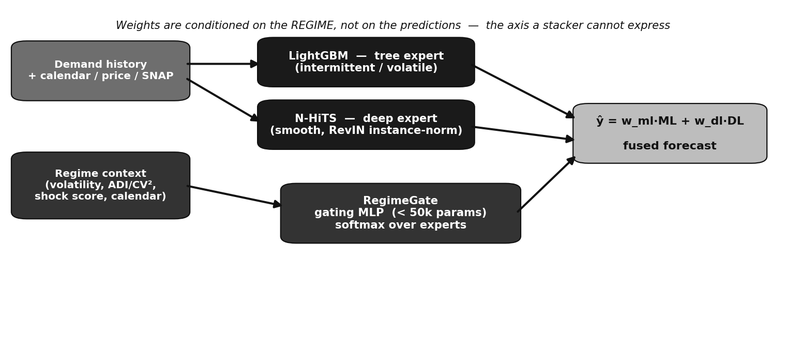

# AI for Public Good — Sustainable & Resilient Supply Chains

### RegimeGate · An Adaptive Fusion Controller for Non-Stationary Demand

**Problem Statement 3 · Round 2 · Team Absolute — Ayan Ahmed Khan**

> Demand in modern supply chains is *non-stationary*: no single forecaster is best across calm and
> turbulent regimes. The usual fixes — a **fixed weighted blend** or a **stacked meta-learner** —
> assume each model's relative competence never changes, which is exactly wrong. **RegimeGate** is a
> tiny (**< 50k-parameter**) gating network that learns *where* each forecaster should be trusted and
> emits **dynamic fusion weights** over two frozen experts (**LightGBM** + **N-HiTS**), conditioned on
> the **observable demand regime** — not on the predictions. That is what places it provably *beyond a
> stacked meta-learner*.

---

## 🏆 Headline results (real Walmart M5)

| Variant | Overall WRMSSE | Smooth regime | Intermittent regime |
|---|---|---|---|
| DL — N-HiTS | 0.760 | **0.634** | 0.886 |
| ML — LightGBM | 0.781 | 0.735 | **0.828** |
| Fixed 60/40 | 0.736 | 0.642 | 0.831 |
| Stacking (predictions-only) | 0.870 | 0.614 | 1.125 |
| **RegimeGate (ours)** | **0.734** ✅ | **0.604** ✅ | 0.865 |

- **Beats the stacked meta-learner by +15.5%** — the stacker *collapses* on heterogeneous demand
  (1.125 on intermittent) because one global blend can't serve opposite regimes.
- **Genuine two-sided specialization** — N-HiTS wins smooth demand, LightGBM wins intermittent, and
  the gate routes between them.
- **Tunable accuracy ↔ robustness dial**; under a calibrated shock battery the robustness setting
  **matches the most shock-robust expert** on every shock.
- Validated with a **leakage-safe, rolling-origin** protocol; interpretable via SHAP and per-segment
  weight analysis. Two controlled identifiability proofs are included.

---

## 📦 What's in this repo

```
.
├── RegimeGate_M5.ipynb        # the full prototype — runs end-to-end on real M5 (Colab T4)
├── web/                       # live demo — Next.js + Tailwind + Framer Motion (animated)
├── dashboard/                 # live demo — Streamlit (Python alternative)
├── docs/
│   ├── RegimeGate_Solution_Document.pdf   # the Round-2 detailed solution document
│   ├── RegimeGate_Solution_Document.tex   # editable LaTeX source
│   └── figs/                              # figures
├── README.md  ·  LICENSE  ·  .gitignore
```

---

## ▶️ Run the prototype (notebook)

Open [`RegimeGate_M5.ipynb`](RegimeGate_M5.ipynb) in **Google Colab**, choose a **T4 GPU**, and
*Run all*. It defaults to a ~2-minute synthetic **smoke test**; set `SMOKE_TEST = False` for the real
**M5** results (you'll upload a free `kaggle.json`). Toggle `GATE_REGIME_BALANCE` to move between the
accuracy- and robustness-optimal operating points.

**GPU:** the free Colab **T4 (16 GB)** is enough — LightGBM is CPU-only; only N-HiTS uses the GPU.
Full multi-level run is ~45–65 min.

## 🎛️ Run the live dashboard

A modern, animated demo where judges inject supply-chain shocks and **watch the gate re-allocate its
fusion weights in real time** (press ▶ Play / scrub the day slider), alongside the real-M5 evidence.
The gate runs **client-side** as a 114-parameter forward pass — no GPU, no backend, no download.

**Primary — Next.js + Tailwind** ([`web/`](web)) · dark, premium, animated:
```bash
cd web && npm install && npm run dev      # → http://localhost:3000
```
Deploy free on **Vercel**: import the repo, set **Root Directory = `web`**, Deploy → public
`…vercel.app` URL for the hackathon *Live Demo* field. See [web/README.md](web/README.md).

**Alternative — Streamlit (Python)** ([`dashboard/`](dashboard)):
```bash
cd dashboard && pip install -r requirements.txt && streamlit run app.py   # → http://localhost:8501
```
Deploy on [share.streamlit.io](https://share.streamlit.io) (main file `dashboard/app.py`).

---

## 🧭 How it works (one diagram)



Two frozen experts forecast in parallel; a context-conditioned gating MLP reads the regime
(volatility, intermittency, a shock z-score, calendar) and emits softmax fusion weights **per step**.
Anti-fragility guards — weight smoothing, a fixed-weight floor, a confidence fallback, and shock-aware
training — keep it from ever being meaningfully worse than the static blend.

Full detail in the [solution document](docs/RegimeGate_Solution_Document.pdf).

## License

[MIT](LICENSE) © 2026 Ayan Ahmed Khan (Team Absolute).
"# AI-for-Public-Good-Sustainable-Resilient-Supply-hackathon" 
